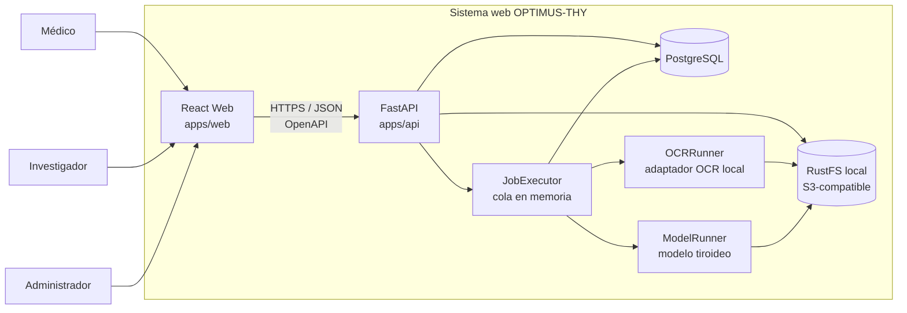

# Arquitectura inicial de OPTIMUS-THY

Este documento acompaña la especificación de TES-4 y describe los contenedores y responsabilidades sin mezclar arquitectura lógica con despliegue físico.

## Propósito

Representar la arquitectura inicial aprobada para el sistema web de gestión de datos clínicos e integración de IA de OPTIMUS-THY.

## Fuente

- Anteproyecto firmado de OPTIMUS-THY.
- Auditoría TES-3 del repositorio de referencia.
- Decisiones aprobadas durante TES-4.

## Actores

- **Médico:** gestiona y consulta información clínica autorizada y resultados.
- **Investigador:** accede a información desidentificada y capacidades de evaluación de modelos según permisos que se definan.
- **Administrador:** administra usuarios, seguridad y auditoría; puede usar una vista operativa de médico o investigador conservando su rol real de administrador.

## Contenedores y límites

- **Web (`apps/web`)**: interfaz React/TypeScript. No es autoridad de autorización.
- **API (`apps/api`)**: FastAPI, casos de uso, autenticación/autorización y contrato OpenAPI.
- **Ejecutor de trabajos**: límite lógico para OCR e inferencia. En la primera versión usa cola en memoria dentro del runtime Python, fuera del request HTTP.
- **PostgreSQL**: fuente durable de verdad para datos estructurados, sesiones, estado de trabajos, resultados y auditoría.
- **RustFS local**: almacenamiento S3-compatible de documentos e imágenes. PostgreSQL conserva metadatos y `object_key`.
- **OCRRunner**: puerto para OCR local, independiente del motor elegido.
- **ModelRunner**: puerto para modelo tiroideo demo/oficial, independiente de framework o pesos.

## Diagrama de contenedores

## Relaciones principales

1. Los usuarios interactúan únicamente con la aplicación web.
2. La web consume la API bajo un contrato generado desde OpenAPI.
3. La API valida sesión, rol y permisos antes de ejecutar casos de uso.
4. Los archivos pesados se almacenan en RustFS; la base de datos conserva metadatos y referencias.
5. OCR e inferencia no se ejecutan dentro del request HTTP; se registran como trabajos durables en PostgreSQL y se procesan por el ejecutor.
6. El motor OCR y el modelo tiroideo se conectan mediante puertos reemplazables.
7. Las acciones relevantes generan evidencia de auditoría.

## Decisiones aplazadas

- matriz exacta de permisos;
- modelo de datos definitivo;
- cifrado y gestión de claves de PII;
- motor OCR definitivo y validación de manuscritos;
- contrato del modelo oficial OPTIMUS-THY;
- necesidad de un worker externo después de medir carga real;
- políticas de retención/versionado/borrado de archivos.

## Fuera de alcance académico

El CMS de proyectos/publicaciones solicitado por OPTIMUS-THY no forma parte de la arquitectura académica de la tesis.
