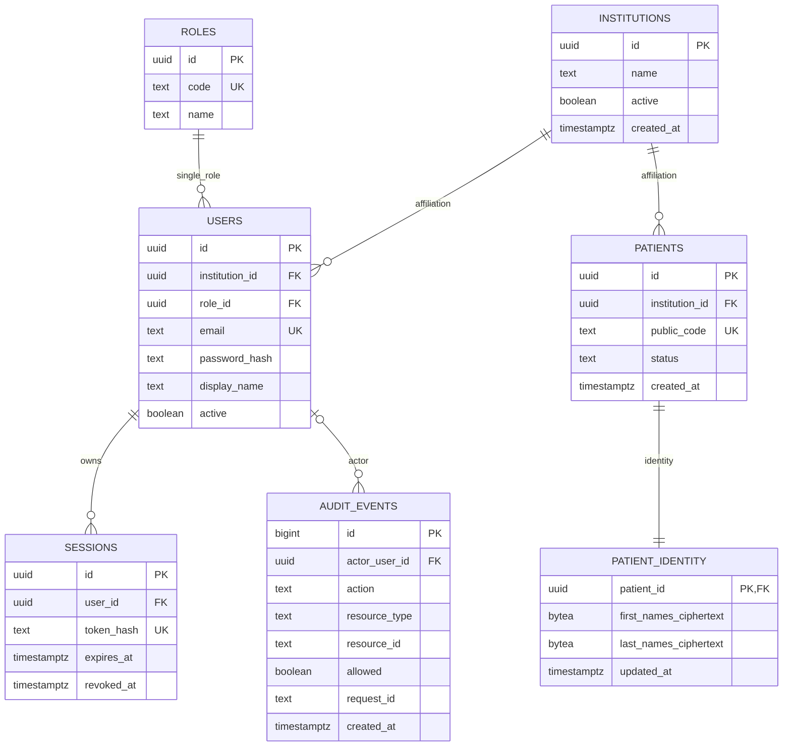

# Modelo de datos inicial — Ola 1

## Alcance y fuentes

Este modelo materializa únicamente lo necesario para autenticación/RBAC, sesiones opacas, primer flujo de pacientes, separación de PII y auditoría mínima. Se deriva del anteproyecto firmado y de las decisiones TES-3/TES-4. El `backend/sql/DDL.sql` del repositorio de referencia se usa como evidencia de diseño, no como requisito.

## Esquemas y tablas que entran ahora

| Esquema | Tabla | Propósito inmediato |
| --- | --- | --- |
| `security` | `institutions` | afiliación organizacional mínima; no implica multi-tenancy |
| `security` | `roles` | catálogo de `administrador`, `medico`, `investigador` |
| `security` | `users` | identidad de acceso y un único rol efectivo |
| `security` | `sessions` | sesiones opacas revocables en PostgreSQL |
| `clinical` | `patients` | identificador operacional del paciente |
| `clinical` | `patient_identity` | nombres/apellidos cifrados, separados de la fila operacional |
| `audit` | `events` | evidencia transversal append-only de acciones relevantes |

## Contrato canónico del paciente para Ola 1

Hasta que TES-10 valide campos adicionales, el primer flujo usa solo:

- `id: UUID` — identificador interno canónico;
- `public_code: str` — identificador operacional visible y único;
- `status: active | inactive`;
- `first_names: str` — PII cifrada en persistencia;
- `last_names: str` — PII cifrada en persistencia.

Cédula, teléfono, correo, dirección, fecha de nacimiento, sexo, número de historia clínica, antecedentes, laboratorios y demás datos clínicos quedan **diferidos** hasta que exista un requerimiento validado. Esto evita convertir campos del prototipo/DDL en requisitos por inercia.

## Diagrama ER simplificado

## Identificadores y relaciones

- UUID para todas las entidades de negocio principales, coherente con TES-4.
- `audit.events.id` usa `BIGINT IDENTITY` porque es append-only y no forma parte del contrato público.
- `security.users.role_id` impone un único rol efectivo por usuario; no se implementa `usuarios_roles`.
- `security.sessions.user_id` usa `ON DELETE CASCADE`; una eliminación excepcional de usuario elimina sus sesiones.
- `clinical.patient_identity.patient_id` usa `ON DELETE CASCADE`; la identidad no existe sin paciente.
- `audit.events.actor_user_id` usa `ON DELETE SET NULL` para conservar evidencia histórica.
- Institución y rol usan `RESTRICT`; se espera desactivar registros en vez de borrar relaciones activas.

## Protección de PII

La clave de cifrado vive fuera de Git y fuera de PostgreSQL en `PII_ENCRYPTION_KEY_B64`. Debe representar exactamente 32 bytes aleatorios codificados en Base64.

La aplicación cifra PII con **AES-256-GCM**. Cada valor usa un nonce aleatorio nuevo de 12 bytes; se almacena `nonce || ciphertext+tag` como `BYTEA`. La clave nunca se escribe en migraciones, seeds, logs ni tablas.

Primera migración: solo nombres y apellidos se materializan como PII porque son suficientes para listar/registrar/detallar un paciente en Ola 1. Los demás campos potencialmente sensibles se documentan como pendientes, no como columnas prematuras.

## Seed de desarrollo

El seed usa datos totalmente simulados:

- una institución de desarrollo asociada a OPTIMUS-THY/ESPOCH;
- tres roles (`administrador`, `medico`, `investigador`);
- usuarios simulados con dominio reservado `.example.test`, deshabilitados hasta TES-7;
- un paciente simulado con PII cifrada.

Los UUID serán determinísticos para que el seed sea idempotente. No se incluirán contraseñas utilizables ni datos reales.

## Diferencias frente al DDL de referencia

| Referencia | Decisión del repo real | Justificación |
| --- | --- | --- |
| esquemas en español (`seguridad`, `pacientes`) | `security`, `clinical`, `audit` | coincide con TES-4 y nombres de módulos del código |
| `usuarios_roles` N:M | `users.role_id` | decisión funcional explícita: un rol real por usuario |
| `pgcrypto` + `clave_dev_v1` | AES-GCM en aplicación + clave de entorno | evita hardcodear secretos y desacopla cifrado de SQL |
| múltiples campos PII desde inicio | solo nombres/apellidos cifrados | no inventar campos antes de TES-10 |
| consentimientos | diferidos | no son necesarios para autenticación ni primer flujo de pacientes |
| casos/encuentros/perfil tiroideo/diagnósticos | diferidos | pertenecen a gestión clínica posterior |
| documentos/OCR/imágenes/IA/investigación/CMS | diferidos | fuera de la primera migración; CMS además está fuera del alcance académico |
| varios estados clínicos del paciente | `active` / `inactive` | evita introducir estados clínicos no requeridos todavía |

## Tablas explícitamente diferidas

No se crean todavía: consentimientos, casos clínicos, encuentros, perfil tiroideo, diagnósticos, archivos/documentos, trabajos OCR, campos OCR, estudios/series/instancias de imagen, modelos/versiones IA, trabajos/resultados de inferencia, datasets/métricas/investigación ni tablas CMS. Cada una requiere un flujo o requisito posterior que justifique su migración.

## Migración y verificación implementadas

- Revisión inicial Alembic: `20260915_01`.
- Migración: `apps/api/alembic/versions/20260915_01_initial_ola1.py`.
- Seed: `python -m optimus_thy.shared.database.seed_dev` / `make seed-dev`.
- Pruebas PostgreSQL: ciclo `upgrade -> downgrade -> upgrade`, tablas esperadas, restricciones únicas/FK, PII cifrada y seed idempotente.
- CI backend levanta PostgreSQL 17 y ejecuta estas pruebas con una base efímera.
