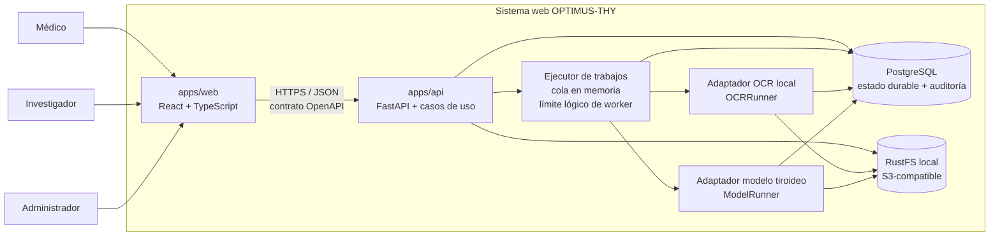

# OPTIMUS-THY — Arquitectura objetivo inicial

**Fecha:** 2026-09-15  
**Tarea:** TES-4 — Definir arquitectura objetivo y decisiones técnicas base  
**Estado:** aprobado por Andrés el 15/09/2026; actualizado en TES-5 para usar RustFS como adaptador local S3-compatible.
**Repositorio:** `AndresGaibor/optimus-thy`

## 1. Propósito

Definir una arquitectura inicial implementable para el sistema web OPTIMUS-THY sin copiar el repositorio de referencia ni convertir prototipos en requisitos. La arquitectura debe cubrir los módulos aprobados en el anteproyecto, mantener trazabilidad y permitir sustituir OCR/modelos de IA sin acoplar el dominio a una tecnología concreta.

## 2. Fuentes y nivel de autoridad

### Alcance aprobado en el anteproyecto

El anteproyecto firmado establece:

- frontend React;
- backend Python;
- PostgreSQL para información estructurada;
- gestión de pacientes, datos clínicos, documentos e imágenes ecográficas tiroideas;
- OCR local para fichas clínicas digitalizadas;
- consumo de un modelo de IA existente proporcionado por OPTIMUS-THY;
- almacenamiento local de imágenes/documentos, con posibilidad de una alternativa compatible con API S3;
- base de datos con metadatos y ubicación de archivos, evitando blobs pesados en tablas;
- módulo de investigación con datos desidentificados, métricas, comparaciones, auditoría de predicciones y análisis de errores;
- administración de usuarios, roles, permisos y auditoría;
- evaluación con pruebas funcionales y evidencias de ejecución.

### Decisiones explícitas del proyecto

Aprobadas durante TES-3/TES-4:

- monorepo modular;
- Clean Architecture modular por capacidad;
- OpenAPI de FastAPI como contrato HTTP canónico;
- PostgreSQL como fuente durable de verdad;
- UUID para entidades principales;
- RustFS local detrás de una abstracción S3-compatible;
- ejecución asíncrona inicial simple, co-localizada y en memoria, fuera del request HTTP;
- sin Redis/RQ en la primera versión;
- sesiones opacas persistidas en PostgreSQL y cookie HttpOnly;
- un solo rol real por usuario;
- administrador con posibilidad de usar vista de médico/investigador sin perder su identidad administrativa;
- separación de identidad sensible del paciente y datos clínicos operacionales;
- `OCRRunner` y `ModelRunner` como puertos reemplazables;
- observabilidad ligera y pruebas por capas.

### No autoritativo

`AndresGaibor/optimus-thy-referencia` es solo una referencia. Sus tablas, nombres de modelos, mocks, roles adicionales, salidas clínicas y dependencias no se consideran requisitos aprobados.

## 3. Principios arquitectónicos

1. **Trazabilidad antes que reutilización:** cada componente debe existir por un requisito aprobado o decisión explícita.
2. **Dominio independiente:** dominio y casos de uso no dependen de FastAPI, SQLAlchemy, RustFS, PaddleOCR, PyTorch ni del modelo demo.
3. **Infraestructura reemplazable:** almacenamiento, OCR, ejecución de trabajos y modelo IA se consumen mediante puertos.
4. **Persistencia durable en PostgreSQL:** la memoria puede coordinar ejecución, pero nunca será la única fuente del estado clínico ni del estado de trabajos.
5. **Privacidad por diseño:** PII separada de información clínica operacional; investigadores consumen proyecciones desidentificadas.
6. **YAGNI:** no introducir Redis, Celery, Kubernetes, microservicios ni observabilidad pesada mientras no exista una necesidad demostrada.
7. **Contrato único:** OpenAPI generado por FastAPI es la fuente canónica del contrato frontend↔backend.

## 4. Arquitectura de contenedores



### Nota sobre el ejecutor

La separación del worker es **lógica desde el código**, pero no implica un servicio distribuido desde la primera versión. Inicialmente, OCR e inferencia se ejecutan mediante un `InMemoryJobExecutor` dentro del runtime Python, fuera del request HTTP. PostgreSQL conserva el registro durable del trabajo. Si una prueba real demuestra que el consumo de CPU/GPU o concurrencia requiere aislamiento, el mismo puerto podrá implementarse con un worker externo sin modificar los casos de uso.

## 5. Estructura objetivo del monorepo

```text
optimus-thy/
├── apps/
│   ├── web/                     # React + TypeScript
│   └── api/                     # FastAPI + aplicación + dominio + adaptadores
├── services/
│   └── worker/                  # reservado para despliegue separado si llega a ser necesario
├── packages/
│   └── contracts/               # OpenAPI versionado y artefactos de contrato
├── infra/
│   ├── docker/
│   ├── postgres/
│   └── rustfs/
├── docs/
│   ├── architecture/
│   ├── adr/
│   └── superpowers/specs/
└── README.md
```

`services/worker` representa el límite futuro para despliegue separado; no obliga a ejecutarlo como proceso independiente en la primera ola.

Los pesos de modelos, datasets clínicos y archivos binarios grandes no se versionan en Git.

## 6. Backend — Clean Architecture modular por capacidad

```text
apps/api/src/optimus_thy/
├── modules/
│   ├── auth/
│   │   ├── domain/
│   │   ├── application/
│   │   ├── infrastructure/
│   │   └── api/
│   ├── patients/
│   ├── documents/
│   ├── imaging/
│   ├── inference/
│   ├── research/
│   └── audit/
├── shared/
│   ├── database/
│   ├── security/
│   ├── storage/
│   ├── jobs/
│   ├── errors/
│   └── observability/
├── config/
└── main.py
```

### Regla de dependencias

- `domain`: entidades, value objects, reglas e interfaces estrictamente de dominio; sin dependencias de frameworks.
- `application`: casos de uso, DTO internos y puertos requeridos por los casos de uso.
- `infrastructure`: SQLAlchemy, PostgreSQL, RustFS, OCR, modelo IA, hashing, sesiones y ejecutores.
- `api`: rutas FastAPI, validación HTTP, dependencias de autenticación y traducción HTTP↔casos de uso.

Los módulos se comunican mediante casos de uso/puertos explícitos; no se permite importar directamente tablas SQLAlchemy de otro módulo como atajo de negocio.

## 7. Frontend

```text
apps/web/src/
├── app/              # bootstrap, providers, router
├── pages/            # composición de pantallas
├── widgets/          # bloques grandes de UI
├── features/         # acciones de usuario
├── entities/         # modelos/queries del dominio de UI
├── shared/           # UI base, utilidades, cliente HTTP
└── generated/api/    # cliente/tipos generados desde OpenAPI
```

### Estado

- TanStack Query para estado remoto, consultas y mutaciones.
- Context únicamente para estado estrictamente de UI.
- No existe `SimulationProvider` en producción.
- Mocks y fixtures solo en tests/desarrollo controlado.

### Autorización

Ocultar botones mejora UX, pero no autoriza. FastAPI es siempre la autoridad final.

## 8. Contrato frontend↔backend

### Fuente canónica

FastAPI/OpenAPI.

Los tipos y cliente TypeScript se generan desde OpenAPI. No se mantienen DTO equivalentes a mano en Python y TypeScript.

### Errores

Formato uniforme inspirado en Problem Details:

```json
{
  "status": 422,
  "title": "Validation error",
  "detail": "One or more fields are invalid",
  "code": "VALIDATION_ERROR",
  "errors": []
}
```

### Paginación inicial

`page` + `page_size` y respuesta:

```json
{
  "items": [],
  "page": 1,
  "page_size": 20,
  "total": 0
}
```

No se introduce cursor pagination hasta que exista una necesidad real.

## 9. Persistencia

### Tecnología

- PostgreSQL;
- SQLAlchemy;
- Alembic para migraciones.

### Identificadores

UUID para entidades principales: usuario, paciente, documento, imagen, trabajo, resultado y versión/modelo. Tablas internas append-only pueden usar `BIGINT` secuencial cuando sea conveniente.

### Esquemas lógicos iniciales

- `security`;
- `clinical`;
- `documents`;
- `ai`;
- `audit`.

El módulo `research` no obliga todavía a crear un esquema físico propio. Consumirá proyecciones/vistas desidentificadas cuya forma exacta se define en TES-6/TES-10.

No se copiarán las 37 tablas del DDL de referencia. TES-6 extraerá únicamente las tablas justificadas por requisitos.

## 10. Separación de identidad del paciente

Frontera conceptual:

```text
clinical.patient
    id UUID
    code
    estado operacional...

clinical.patient_identity
    patient_id UUID
    nombres
    identificación
    contacto
    otros datos sensibles...
```

El investigador no consume `patient_identity` directamente. El mecanismo exacto de cifrado, claves, columnas y estrategia de desidentificación se aplaza a TES-6/TES-10 y debe quedar fuera del repositorio en cuanto a secretos.

## 11. Archivos e imágenes

### Puerto

`ObjectStorage`.

### Adaptador inicial

RustFS local usando API S3-compatible.

### PostgreSQL guarda

- `object_key`;
- checksum;
- MIME type;
- tamaño;
- metadatos de clasificación/asociación;
- timestamps y actor cuando aplique.

### PostgreSQL no guarda

Blobs pesados de imágenes ecográficas o documentos clínicos.

La elección de RustFS es una decisión del proyecto compatible con el anteproyecto, que permite un repositorio local o una alternativa S3-compatible. La aplicación consume configuración `S3_*` y no depende de APIs propietarias de RustFS.

## 12. Trabajos asíncronos

### Estados canónicos propuestos

```text
queued
running
succeeded
failed
cancelled
```

Estos estados serán confirmados técnicamente en TES-6 al materializar el modelo de datos.

### Primera implementación

`InMemoryJobExecutor`:

1. API crea el registro durable del trabajo en PostgreSQL (`queued`).
2. API encola el `job_id` en memoria.
3. El ejecutor procesa fuera del request HTTP.
4. Actualiza a `running` y luego `succeeded`/`failed`.
5. El resultado y errores sanitizados quedan en PostgreSQL.
6. Al iniciar la aplicación, una rutina de recuperación puede localizar trabajos recuperables `queued` y reprogramarlos.

### Escalamiento futuro

Si pruebas reales muestran necesidad de aislamiento o mayor concurrencia, implementar otro `JobExecutor` con worker externo. Redis/RQ es una posibilidad, no un requisito aprobado.

## 13. OCR

### Puerto

`OCRRunner`.

### Contrato conceptual

Entrada:

- referencia a documento/imagen almacenado;
- opciones de idioma/configuración cuando correspondan.

Salida:

- texto bruto;
- bloques/líneas cuando el motor los proporcione;
- coordenadas cuando existan;
- confianza cuando exista;
- motor/versión;
- duración y metadatos técnicos.

### Adaptadores

PaddleOCR PP-OCRv5 Mobile es candidato principal de benchmark y Tesseract 5 (`spa`) baseline comparativo. No son requisitos permanentes.

No se diseñan extractores rígidos por plantilla hasta disponer de fichas reales.

## 14. IA tiroidea

### Puerto

`ModelRunner`.

### Contrato mínimo inicial

- identificador/versión del modelo;
- estado de ejecución;
- predicción genérica;
- confianza/probabilidad cuando el modelo la ofrezca;
- timestamps/duración;
- metadatos crudos sanitizados o referencia a artefactos.

Heatmaps, bounding boxes, TI-RADS, Bethesda, recomendaciones y otros campos no son obligatorios hasta conocer el contrato oficial de OPTIMUS-THY.

### Modelo demo

Cualquier modelo público utilizado antes del modelo oficial es exclusivamente una dependencia temporal de demostración/integración. No define el dominio ni la tesis clínica.

## 15. Autenticación, roles y sesiones

### Sesión

- credenciales verificadas por FastAPI;
- contraseñas con Argon2id;
- sesión opaca persistida en PostgreSQL;
- cookie `HttpOnly`, `Secure`, `SameSite`;
- no JWT persistido en `localStorage`.

### Roles

Un único rol real por usuario:

- `medico`;
- `investigador`;
- `administrador`.

Médico e investigador no cambian de rol.

El administrador puede seleccionar una vista operativa de médico o investigador, pero la sesión conserva `real_role=administrador`. La autorización y auditoría siempre conocen al actor real.

La matriz exacta de permisos se define en TES-7/TES-10.

## 16. Auditoría y observabilidad

### Auditoría funcional

Registrar al menos:

- `actor_user_id`;
- rol real;
- vista activa de admin cuando aplique;
- acción;
- tipo e ID de recurso;
- resultado permitido/denegado;
- timestamp;
- `request_id`.

No registrar contraseñas, tokens, secretos ni contenido clínico completo en logs.

### Observabilidad inicial

- logs estructurados;
- `request_id`;
- `job_id` cuando aplique;
- duración y estado de OCR/inferencia;
- endpoint `/health`;
- métricas simples derivables de trabajos y auditoría.

Prometheus/Grafana no son requisito de la primera ola.

## 17. Estrategia de pruebas

### Pirámide

1. Unitarias de dominio y casos de uso.
2. Integración para PostgreSQL, RustFS/S3 y adaptadores.
3. Tests de API FastAPI.
4. Tests de componentes/flows críticos del frontend.
5. Pocos E2E de flujos esenciales.
6. Benchmarks OCR/IA separados porque no son lógica determinista.

### CI mínimo

En cada cambio relevante:

- formato/lint;
- typecheck;
- unitarias;
- integración ligera;
- build frontend/API cuando corresponda.

Pesos grandes, benchmarks de IA/OCR y pruebas costosas no corren obligatoriamente en cada commit.

## 18. Cobertura del alcance aprobado

| Módulo aprobado | Componentes arquitectónicos |
|---|---|
| Gestión Clínica y Documental | `patients`, `documents`, `imaging`, PostgreSQL, RustFS, `OCRRunner` |
| Inferencia y Resultados IA | `inference`, `ModelRunner`, ejecutor de trabajos, PostgreSQL, RustFS |
| Investigación y Evaluación | `research`, proyecciones desidentificadas, registro de versiones/resultados/auditoría |
| Administración y Seguridad | `auth`, `audit`, sesiones, RBAC, separación PII, auditoría transversal |

## 19. ADR resumidos

| ADR | Decisión | Alternativas descartadas / aplazadas | Razón |
|---|---|---|---|
| ADR-001 | Monorepo modular | repos separados; monorepo plano | coordinación simple, CI unificado y límites claros |
| ADR-002 | Clean Architecture modular por capacidad | capas globales únicas | evita acoplamiento y permite entender/probar módulos aisladamente |
| ADR-003 | OpenAPI como contrato canónico | DTO manual duplicado | evita inconsistencias Python/TS encontradas en TES-3 |
| ADR-004 | PostgreSQL + UUID | mezcla int/UUID | contrato consistente y durable |
| ADR-005 | RustFS local vía puerto S3 | MinIO; blobs en DB; path local acoplado | mantenimiento activo, alineación con anteproyecto y reemplazabilidad |
| ADR-006 | Cola en memoria + estado durable en PostgreSQL | Redis/RQ inmediato | menor complejidad sin perder trazabilidad durable |
| ADR-007 | Sesión opaca en PostgreSQL | JWT en localStorage | revocación simple y menor exposición del token en navegador |
| ADR-008 | PII separada | identidad inline con ficha clínica | privacidad y desidentificación para investigación |
| ADR-009 | `OCRRunner` / `ModelRunner` | acoplar dominio a motor/modelo | permite demo→modelo oficial y benchmark OCR sin reescritura |
| ADR-010 | Observabilidad ligera | stack de métricas completo | YAGNI; mantener evidencia suficiente sin infraestructura innecesaria |

## 20. Decisiones aplazadas explícitamente

No son requisitos resueltos todavía:

- matriz exacta de permisos por acción/recurso;
- campos canónicos mínimos completos del paciente;
- algoritmo y gestión de claves para cifrado de PII;
- estrategia exacta de anonimización/desidentificación;
- motor OCR definitivo y soporte real de manuscritos;
- contrato del modelo oficial OPTIMUS-THY;
- necesidad de worker externo/broker después de medir ejecución real;
- retención/borrado/versionado de archivos clínicos;
- límites de tamaño/formato para cargas;
- necesidad de capacidades visuales del modelo (heatmap/bbox/etc.).

Estas decisiones deben resolverse mediante requerimientos, pruebas o evidencia; no por inferencia desde el repositorio de referencia.

## 21. Fuera de alcance académico de esta arquitectura

El CMS de proyectos/publicaciones solicitado operativamente por OPTIMUS-THY queda fuera del alcance académico de la tesis. Si se desarrolla, se mantendrá separado y no contará como evidencia de cumplimiento de los objetivos del trabajo de titulación.

## 22. Trazabilidad operativa

```text
Anteproyecto aprobado
        ↓
TES-3 auditoría del repositorio de referencia
        ↓
TES-4 arquitectura objetivo (este documento)
        ↓
TES-5 inicialización/quality gates
TES-6 modelo de datos y migraciones
TES-7 autenticación/RBAC
TES-14 documentación técnica/diagramas
        ↓
Implementación + pruebas + evidencias
        ↓
Manual técnico / tesis
```

## 23. Criterios de aceptación de TES-4

- Arquitectura cubre los cuatro módulos aprobados: **sí**.
- Distingue aplicación, infraestructura e IA: **sí**.
- Decisiones tienen justificación técnica: **sí**.
- Supuestos/pendientes están marcados: **sí**.
- Puede utilizarse para inicializar el repositorio real y alimentar documentación de tesis: **sí; aprobado por Andrés**.
